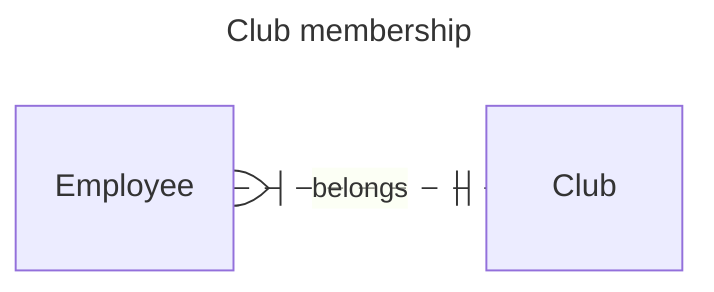
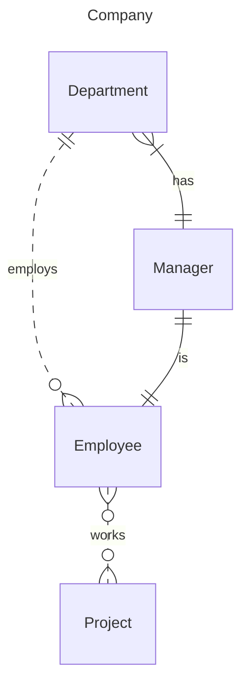

# Week 8: ER Exercises

## Task 1: Warm-up by interpreting an ER diagram

TBD

## Task 2: More warm-up with multiplicity constraints

TBD

## Task 3: Clubs

```mermaid
---
title: Club membership
---
erDiagram
  direction LR
  Employee one or many optionally to only one Club : belongs
```

## Task 4: Company

```mermaid
---
title: Company
---
erDiagram
  direction TB
  Department only one optionally to many Employee : employs
  Department one or many to one Manager : has
  Manager one to one Employee : is
  Employee many optionally to many Project : works
```
