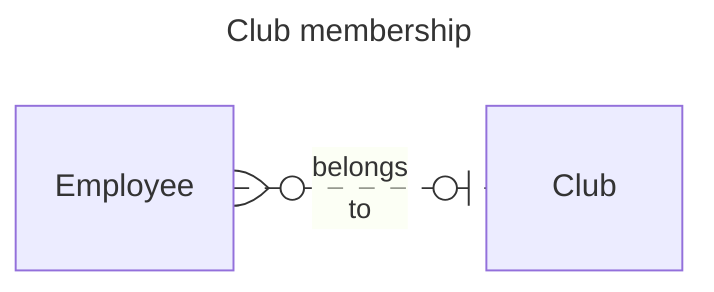
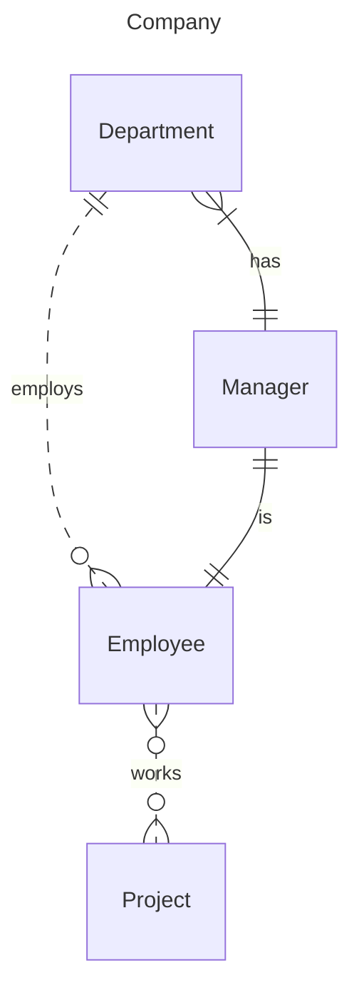

# Week 8: ER Exercises

## Task 1: Warm-up by interpreting an ER diagram

Suppose we are organising one-day boat cruises. We have one boat, and there are plenty of part-time sailors available. The conceptual model is visualised as the ER diagram below.

Are the statements below true or false? Give arguments!

1. *There can be a crew of 10 sailors.* **True.**
2. *The minimum size of a crew is one.* **False.** The minimum size is two, one is the captain and one is the engineer. 
3. *"John Smith" (snn: "123") cannot be a captain in two different crews.*  **False.** A sailor can be a captain in zero or more different crews.
4. *There can be a crew of 6 sailors that consists of the captain and 5 crew members.* **False.** A crew must include an engineer, which is missing from this list.
5. *There can be a sailor who has not joined any crew yet.* **True.**
6. *"John Smith" (snn: "123") can be a member of two different crews that sail on 20.3.2016.* **False.** Sailing date is the primary key.

## Task 2: More warm-up with multiplicity constraints

Determine multiplicity constraints for the relationship types below. Mark the constraints (min..max) to the diagrams.

*   **Person (0..*)** — owns — **(1..1) Dog**

*   **Hotel (1..1)** — has — **(1..*) Room**

## Task 3: Clubs

> "A company organizes a lot of activities for its employees. There are many clubs (tennis club, cycling club, theatre club, etc.) in the company. Each employee may join any club, but they are not allowed to belong to more than one club."

## Task 4: Company

> "In a company, there is a division that operates many departments. Each department employs many people. Each employee is employed by exactly one department. Each department has a manager. The manager of the department is always one of the employees who are employed by the department. In addition, there are many projects. Each employee may work in many projects. Each project has many project members."

