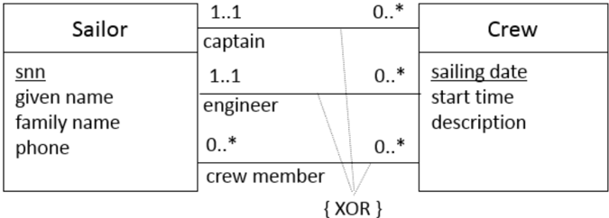
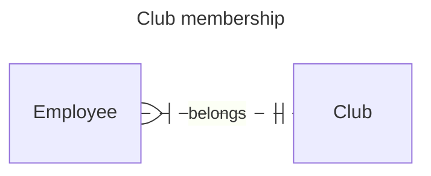
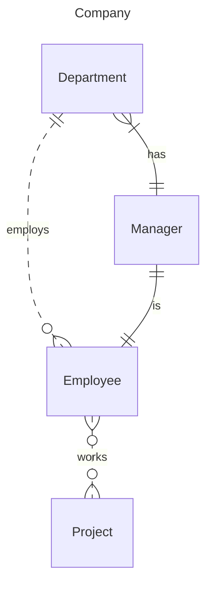

# Week 8: ER Exercises

## Task 1: Warm-up by interpreting an ER diagram

Suppose we are organising one-day boat cruises. We have one boat, and there are plenty of part-time sailors available. The conceptual model is visualised as the ER diagram below.

Are the statements below true or false? Give arguments!

1. *There can be a crew of 10 sailors.* **True.**
2. *The minimum size of a crew is one.* **False.** The minimum size is two, one is the captain and one is the engineer. 
3. *"John Smith" (snn: "123") cannot be a captain in two different crews.*  **False.** A sailor can be a captain in zero or more different crews.
4. *There can be a crew of 6 sailors that consists of the captain and 5 crew members.* **False.** A crew must include an engineer, which is missing from this list.
5. *There can be a sailor who has not joined any crew yet.* **True.**
6. *"John Smith" (snn: "123") can be a member of two different crews that sail on 20.3.2016.* **False.** Sailing date is the primary key.

## Task 2: More warm-up with multiplicity constraints

TBD

## Task 3: Clubs

## Task 4: Company

