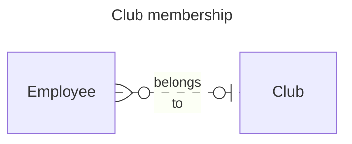
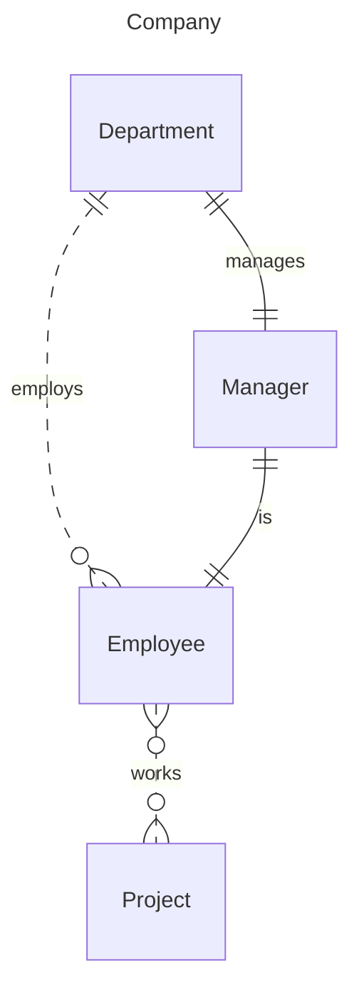
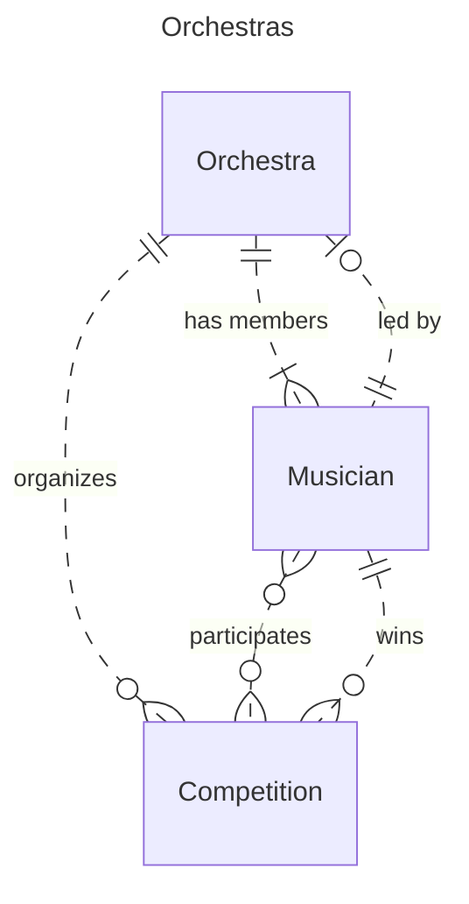
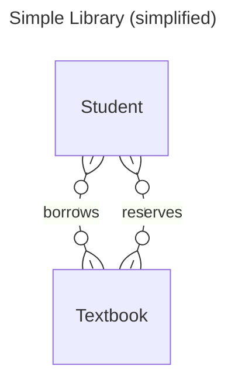
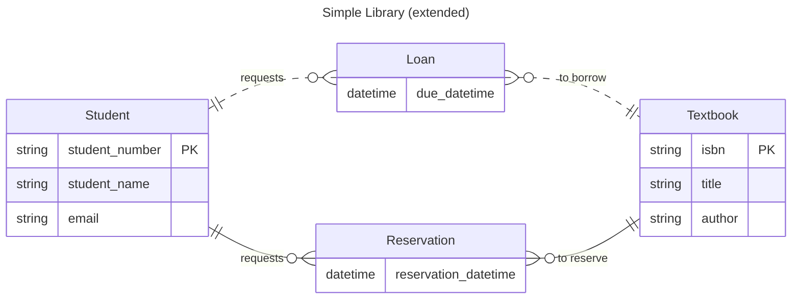
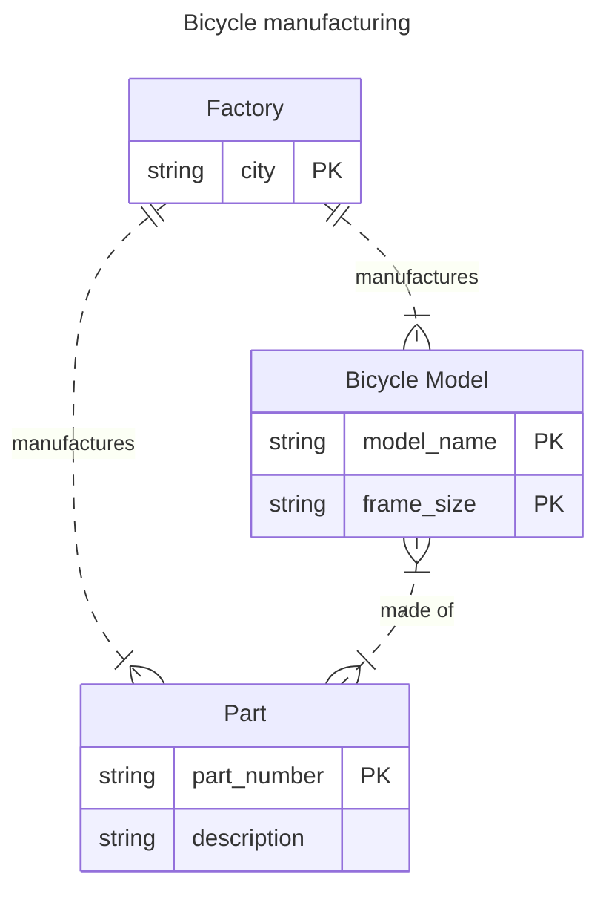

# Week 8: ER Exercises

## Task 1: Warm-up by interpreting an ER diagram

Suppose we are organising one-day boat cruises. We have one boat, and there are plenty of part-time sailors available. The conceptual model is visualised as the ER diagram below.

Are the statements below true or false? Give arguments!

1. *There can be a crew of 10 sailors.* **True.**
2. *The minimum size of a crew is one.* **False.** The minimum size is two, one is the captain and one is the engineer. 
3. *"John Smith" (snn: "123") cannot be a captain in two different crews.*  **False.** A sailor can be a captain in zero or more different crews.
4. *There can be a crew of 6 sailors that consists of the captain and 5 crew members.* **False.** A crew must include an engineer, which is missing from this list.
5. *There can be a sailor who has not joined any crew yet.* **True.**
6. *"John Smith" (snn: "123") can be a member of two different crews that sail on 20.3.2016.* **False.** Sailing date is the primary key.

## Task 2: More warm-up with multiplicity constraints

Determine multiplicity constraints for the relationship types below. Mark the constraints (min..max) to the diagrams.

*   **Person (0..*)** — owns — **(1..1) Dog**

*   **Hotel (1..1)** — has — **(1..*) Room**

## Task 3: Clubs

> "A company organizes a lot of activities for its employees. There are many clubs (tennis club, cycling club, theatre club, etc.) in the company. Each employee may join any club, but they are not allowed to belong to more than one club."

## Task 4: Company

> "In a company, there is a division that operates many departments. Each department employs many people. Each employee is employed by exactly one department. Each department has a manager. The manager of the department is always one of the employees who are employed by the department. In addition, there are many projects. Each employee may work in many projects. Each project has many project members."

## Task 5: Orchestras 

> "There are many orchestras. Each musician belongs to exactly one orchestra. There are many music competitions organized every year. Musicians may participate in several music competitions yearly. The musician who performs the best in a music competition wins the particular competition. Each competition is organized by exactly one orchestra. Each orchestra has a leader. The orchestra leader is always a musician who is a member of the orchestra."

## Task 6: Simple library

Create an ER diagram that captures all the given information. Identify all entity types, attributes, and relationship types. Underline the unique identifier (if any exists). Do not add any attributes that cannot be derived directly from the given text.

> "In the university library, there is a single copy of every recommended course textbook. All students are allowed to borrow textbooks. The loan period is two days. Textbooks out on loan can be reserved."

Examples of important user transactions include the following:

- List of textbooks (name, author, ISBN).
- List of overdue loans (due date, textbook name, student number, student name, email).
- List of reservations for a certain textbook (textbook name, reservation date and time, student number, student name, email).

### Simplified version

### Extended version

## Task 7: Bicycle manufacturing

Create an ER diagram that captures all the given information. Identify all entity types, attributes, and relationship types. Underline the unique identifier (if any exists). Do not add any attributes that cannot be derived directly from the given text.

> "A company manufactures many models of road racing bicycles. Each bicycle model is characterized by a model name and frame size. Each model is made up of many parts, and each part may be used in the manufacture of more than one model. Each part has a unique part number and a description. Each bicycle model is manufactured at just one of the company's factories, which are located in Helsinki, Turku, and Tampere - one factory in each city. Each factory manufactures many types of parts. Each type of part is manufactured at one factory only."

