# Logical Database Design Exercises

## Task 1: Warm-up

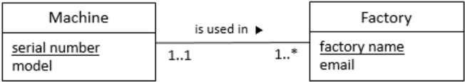

<pre>
Machine (<ins>serialnumber</ins>, model)
Factory (<ins>factoryname</ins>, email, serialnumber)
    FK (serialnumber) REFERENCES Machine (serialnumber)
</pre>

## Task 2: Warm-up drills with simple diagrams

a.  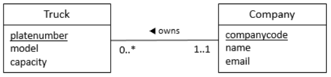

b.  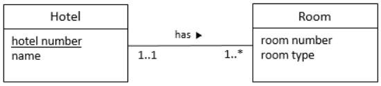

c.  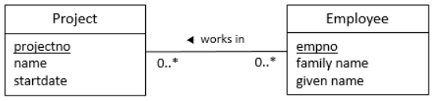

d.  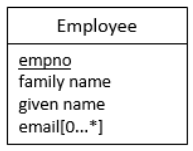

e.  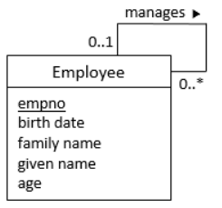

## Task 3: Translating ER diagrams to relation schemas

a.  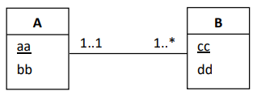

b.  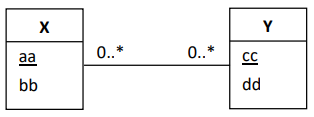

c.  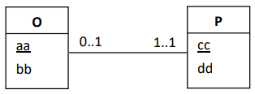

## Task 4: Boat crews

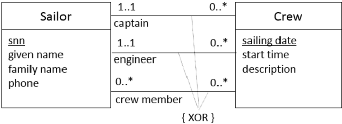

## Task 5: University

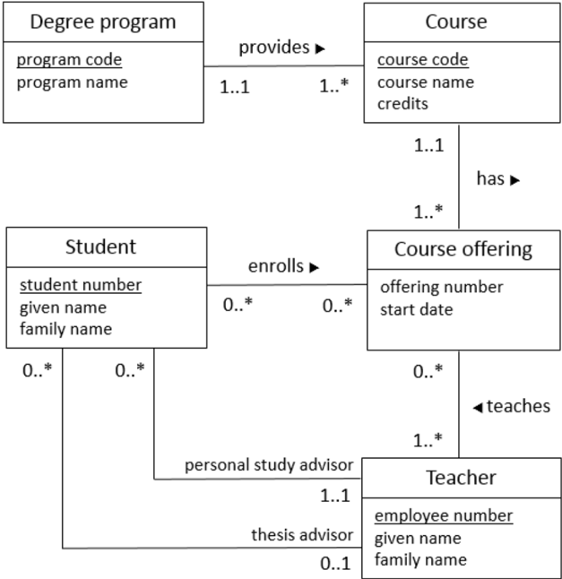